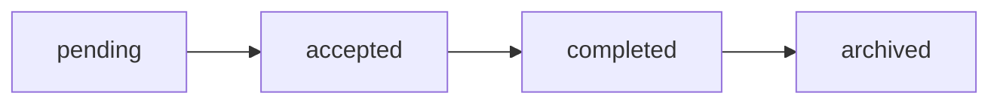

## What a collaboration is in ModelBoard

A collaboration in ModelBoard is a **Collabs project** created from a **proposal** between a sender and one or more receivers.

When you start a new project from the Collabs hub, ModelBoard creates a proposal record that tracks:

- Who is sending the collaboration request

- Who is being invited

- What the project is about

- The current status in the collaboration lifecycle

That proposal powers the workflow page at `/collab/{id}`, where you manage collaborators, assets, and communication for that project.

<Callout kind="info" collapsed="false">
  Think of a collaboration as a shared project space backed by a proposal: the sender owns the project, receivers get access based on their invite permissions, and both sides use the same workflow surfaces to keep work and communication in one place.
</Callout>

## Where collaborations live in the app

The **Collabs hub** at `/collabs` is your home for collaboration projects.

From the hub you can:

- See projects you have sent or received

- Check the current status of each proposal

- Open any project workflow page at `/collab/{id}`

To start a new project, use the actions in the hub:

- **New Blank Project** – creates a draft proposal/project and takes you straight into the workflow page so you can add details and invites.

- **New Collaboration** (where available) – starts a new proposal, typically with some context prefilled (for example, from another surface in the app).

Once you create a project, ModelBoard treats it as a proposal in the `collab_proposals` table with a lifecycle status that updates as participants act on the invite.

## Collaboration lifecycle and statuses

Every collaboration project moves through a clear set of statuses stored on the proposal:

Each status has a specific meaning in the UI and for your workflow.

- **pending** – You have sent a collaboration request that one or more receivers have not accepted yet. The project is open, but key collaborators still need to respond.

- **accepted** – Receivers have accepted the proposal. The collaboration is active, and you use the workflow tabs (Overview, Files, Post-Editor, etc.) to coordinate work and assets.

- **completed** – You have marked the collaboration as finished. The project is no longer active work, but you can still reference its assets and history.

- **archived** – You have moved the project out of your main view. Archived collaborations stay available for record-keeping but no longer show as current work.

<Callout kind="tip" collapsed="false">
  If a project looks stalled, check whether the proposal is still `pending`. Until receivers accept, they see it as a collaboration request, not as an active project.
</Callout>

## End-to-end collaboration workflow

Use this walkthrough as the concrete, in-app flow from creating a Collabs project through closing it out.

<Steps>
  <Step title="Create a new project from the Collabs hub" icon="rocket" title-type="p">
    Start at the Collabs hub at `/collabs`.

    - Click **New Blank Project** (or **New Collaboration** where available).

    - Confirm that ModelBoard opens a workflow page at a URL like `/collab/{id}`.

    - Add a clear title and description so invitees immediately understand what the project is about.

    **Success looks like** you see a new project in `/collabs` with status `pending` and you can open its workflow page from the list.
  </Step>

  <Step title="Set up the project overview" icon="folder" title-type="p">
    Configure the **Overview** tab so collaborators have context when they accept the invite.

    - Describe the project goal, scope, and any key dates in plain language.

    - Add links or references to relevant work so collaborators know what style or usage you expect.

    - Save your changes so receivers see the same information when they open the project.

    **Success looks like** you can open the Overview tab on `/collab/{id}` and understand the project without needing extra messages.
  </Step>

  <Step title="Invite collaborators and set permissions" icon="users" title-type="p">
    Use the **Collaborators** tab to add people to the project.

    - Open the invite UI for the project.

    - Search for existing users by profile `display_name` or `username` and add them as collaborators.

    - If you want to invite someone by email, enter their email in the invite field:

      - If the email matches an existing user, ModelBoard sends an in-app collaboration request.

      - If the email does not match any user, ModelBoard sends an external email invite that links back to the project.

    - Choose permissions for each invite:

      - **View** – always enabled so they can open the project and see its content.

      - **Comment** – allow them to leave comments where supported in the workflow.

      - **Upload** – allow them to upload or add files in the Files and related tabs.

    When you send the invite, ModelBoard stores or updates the proposal with `status: 'pending'` and sends a `collaboration_request` notification to in-app receivers.

    **Success looks like** each invited collaborator appears in the project’s Collaborators list with the correct permissions and shows as having a pending request.
  </Step>

  <Step title="Wait for receivers to accept the proposal" icon="check-circle" title-type="p">
    Once you send invites, collaborators need to accept the collaboration request.

    - Receivers see a `collaboration_request` notification and/or an email with a link to the project or communications view.

    - When a receiver accepts, the proposal status moves toward `accepted` so the collaboration becomes active.

    - If someone declines or ignores the request, the project can remain `pending` until you update or close it.

    **Success looks like** the project appears as `accepted` in `/collabs` for involved users, and collaborators can open `/collab/{id}` from their side.
  </Step>

  <Step title="Use workflow tabs to run the project" icon="settings" title-type="p">
    With the proposal accepted, use the workflow surfaces on `/collab/{id}` to collaborate:

    - Keep summary details up to date in **Overview**.

    - Manage participants in **Collaborators**.

    - Track verification or agreements in **Compliance**.

    - Share and organize files in **Files** and related tabs.

    - Coordinate communication through **Project Chat**.

    **Success looks like** most project activity happens inside the workflow page instead of scattered across separate tools.
  </Step>

  <Step title="Mark the project completed and archive when ready" icon="upload" title-type="p">
    When work is done, close out the collaboration.

    - Update any final assets in the Files, Post-Editor, or Release Assets tabs.

    - Change the proposal status to **completed** when the main work is finished. It will be archived as a reference for compliance purposes and available if ever you need to consult it later while removing it from your active project list.

    **Success looks like** the project shows as `completed` and `archived` in `/collabs`, and you can still open `/collab/{id}` to review history and assets.
  </Step>
</Steps>

## What you can do inside a project

The collaboration workflow page at `/collab/{id}` is organized into tabs so you can manage different parts of the project in one place.

### Overview

Use the **Overview** tab to keep the core story of the project in one place.

- Summarize the project goal, scope, and timing.

- Add context that helps invitees decide whether to accept.

- Keep this up to date as the project evolves so it reflects the current plan.

### Collaborators

The **Collaborators** tab shows who is involved and what they can do.

- See the list of collaborators tied to the proposal.

- Open the invite UI to add new collaborators or adjust permissions.

- Check whether invites are still `pending` or fully accepted.

When you change permissions here, you directly affect what those users can do in the other tabs.

### Compliance

Use the **Compliance** tab to track verification and any checks associated with the collaboration.

- Confirm that collaborators meet your verification expectations.

- Reference compliance-related details while you review or share assets.

- Keep compliance information close to the project instead of in separate documents.

### Files

The **Files** tab surfaces project files through components such as `ProjectFilesTab`.

- Upload or manage files relevant to the collaboration.

- Keep reference material and deliverables attached to the project.

- Use permissions to control who can upload or only view files.

### Release Assets

The **Release Assets** tab is for assets that are closer to final or approved.

- Collect files intended for publishing or delivery.

- Separate in-progress work (in Files) from assets ready to release.

### Schedule

Use the **Schedule** tab to keep time-based details in context.

- Track key dates related to the project (for example, shoots, internal milestones, launch dates).

- Reference schedule information while discussing or updating the project.

### Project chat

Chat components such as `ProjectChat` provide conversation directly inside the project.

- Use chat to discuss decisions, ask questions, and share quick updates.

- Keep project communication attached to the collaboration instead of in separate messaging tools.

<Callout kind="info" collapsed="false">
  Different tabs may be more or less important depending on your role. Owners typically focus on Collaborators, Compliance, and Release Assets, while collaborators spend more time in Files, and project chat.
</Callout>

## Roles, ownership, and permissions

Different people see the same collaboration through different lenses, but the feature centers on **project owners/senders** and **collaborators/receivers**, with behavior shaped by permissions.

<Tabs>
  <Tab title="Project owner (sender)" icon="shield">
    **Focus:** Create the proposal, choose collaborators, and control access and status.

    - Start new projects from `/collabs` and configure the Overview before sending invites.

    - Use the invite UI to search profiles or send email invites, choosing **View**, **Comment**, and **Upload** permissions intentionally.

    - Monitor proposal status (`pending`, `accepted`, `completed`, `archived`) and update it as the project moves forward.

    - Adjust collaborator permissions when responsibilities change instead of sharing accounts.

    - Close out projects by setting them to `completed` and archiving when they are no longer active.
  </Tab>

  <Tab title="Collaborator (receiver)" icon="user">
    **Focus:** Respond to collaboration requests and contribute within the permissions you have.

    - Watch for `collaboration_request` notifications or email invites linking to the project.

    - Review the Overview and, where applicable, Compliance details before accepting.

    - Check your permissions in the Collaborators tab:

      - With **View**, you can open the project, see content across tabs, and follow progress.

      - With **Comment**, you can leave feedback where comments are supported.

      - With **Upload**, you can add files through the Files and related tabs.

    - Use project chat for questions and clarifications instead of separate channels.

    - Let the owner know if your permissions do not match what you need to do the work.
  </Tab>

  <Tab title="Shared expectations" icon="info">
    **Focus:** Keep everyone aligned on what the collaboration space represents.

    - Treat `/collab/{id}` as the source of truth for project context, files, and decisions.

    - Use the Collaborators tab, not manual lists, to understand who has access.

    - Expect that ownership stays with the sender: they control status changes and archiving.

    - Use permissions as a guide for behavior: do not work around **View**-only access by asking others to upload on your behalf.
  </Tab>
</Tabs>

## Permissions, privacy, and compliance

Collabs projects are shared workspaces, not public content. Only people explicitly added as collaborators on a project should see its internal details.

The invite UI exposes three permission toggles:

- **View** – always enabled; gives read access to the project surfaces you are allowed to see.

- **Comment** – allows you to leave feedback where comments are supported.

- **Upload** – allows you to add files or assets in the Files and related tabs.

<Callout kind="info" collapsed="false">
  Use **View** for anyone who needs visibility, **Comment** for people providing feedback or approvals, and **Upload** for collaborators responsible for delivering files. Grant the higher levels only when they are necessary.
</Callout>

Respect privacy when you include personal information, images, or project details in a collaboration.

- Keep sensitive information (for example, IDs, private contact details, rates) limited to projects and collaborators who actually need it.

- Use the Compliance tab to keep verification or agreement-related information close to the project, but do not treat it as a substitute for your own record-keeping.

- Remember that external email invites may expose the project title and basic context in the email; write titles and descriptions accordingly.

<Callout kind="alert" collapsed="false">
  This documentation does not provide legal advice. For questions about consent, releases, IP ownership, or regulatory obligations, involve your legal or compliance team before you publish or reuse collaboration assets.
</Callout>

## Common issues and how to handle them

<ExpandableGroup>
  <Expandable title="An invite stays pending and the collaborator has not joined" default-open="false">
    When a proposal stays in the `pending` state, the receiver may not have seen or acted on the invite.

    - Confirm that the collaborator’s email or profile you invited is correct in the Collaborators tab.

    - Ask the collaborator to check their in-app notifications for a `collaboration_request`.

    - If you used email, ask them to check their inbox (and spam) for the external invite.

    - Resend the invite or create a new one if you suspect the original email address was wrong.

    If the collaboration needs to move ahead with someone else, update the invite list rather than reusing the same pending entry.
  </Expandable>

  <Expandable title="The invitee cannot find the project in their Collabs hub" default-open="false">
    Sometimes receivers accept from email or notifications but still are not sure where to go.

    - Ask them to open `/collabs` while logged in with the same account that received the invite.

    - Confirm that the proposal status is `accepted` and that their profile appears in the Collaborators tab.

    - Share the direct `/collab/{id}` link with them once they have account access.

    If the project still does not appear, verify that they did not accidentally use a different email or account when signing up.
  </Expandable>

  <Expandable title="A collaborator has the wrong permissions (cannot comment or upload)" default-open="false">
    If someone cannot perform an action you expect, check their permissions on the project.

    - Open the Collaborators tab and review their **View**, **Comment**, and **Upload** toggles.

    - Enable **Comment** if they need to leave feedback inside the workflow.

    - Enable **Upload** if they are responsible for adding or updating files.

    - Save changes and ask them to refresh the `/collab/{id}` page.

    Avoid sharing files or feedback through side channels as a workaround; update permissions so the work happens in the project.
  </Expandable>

  <Expandable title="An external invite recipient is not on ModelBoard yet" default-open="false">
    External invites send a branded email with a link (for example, to `/communications?proposal={id}`) so the recipient can respond.

    - Ask the recipient to follow the link from the email and complete any required signup or login.

    - Once they create a ModelBoard account with that email, the proposal links to their user profile.

    - They should then see the collaboration request in their notifications and `/collabs`.

    If they signed up with a different email than the one you invited, send a new invite to the email tied to their account.
  </Expandable>

  <Expandable title="A project feels done but still shows as active" default-open="false">
    Completed work that still appears active can clutter your `/collabs` hub.

    - Review the project on `/collab/{id}` to confirm assets and communication are up to date.

    - Change the proposal status to **completed** when the main work is finished.

    - Archive the project so it no longer appears in your active list but stays available for reference.

    Keeping statuses accurate makes it easier for everyone to see which collaborations still require attention.
  </Expandable>
</ExpandableGroup>

