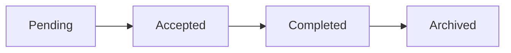

## What a collaboration is in ModelBoard

A collaboration in ModelBoard is a **Collabs project** created from a **proposal** between a sender and one or more receivers.

When you start a new project from the Collabs hub, ModelBoard creates a proposal record that tracks:

- Who is sending the collaboration request

- Who is being invited

- What the project is about

- The current status in the collaboration lifecycle

That proposal powers the workflow page at `/collab/{id}`, where you manage collaborators, assets, and communication for that project.

<Callout kind="info" collapsed="false">
  Think of a collaboration as a shared project space backed by a proposal: the sender owns the project, receivers get access based on their Compliance Role and Access Scope, and both sides use the same workflow surfaces to keep work and communication in one place.
</Callout>

## Where collaborations live in the app

The **Collabs hub** at `/collabs` is your home for collaboration projects.

From the hub you can:

- See projects you have sent or received

- Check the current status of each proposal

- Open any project workflow page at `/collab/{id}`

To start a new project, use the actions in the hub:

- **New Blank Project** – creates a draft proposal/project and takes you straight into the workflow page so you can add details and invites.

- **New Collaboration** (where available) – starts a new proposal, typically with some context prefilled (for example, from another surface in the app).

Once you create a project, ModelBoard saves the project proposal and updates its lifecycle as participants act on the invite.

## Collaboration lifecycle and statuses

Every collaboration project moves through clear lifecycle labels:

```mermaid
graph LR
  A[Pending] --> B[Accepted]
  B --> C[Completed]
  C --> D[Archived]
```

Each label has a specific meaning in the UI and for your workflow.

- **Pending** – You have sent a collaboration request that one or more receivers have not accepted yet. The project is open, but key collaborators still need to respond.

- **Accepted** – Receivers have accepted the proposal. The collaboration is active, and you use the Production, Post-Production, and Distribution stages to coordinate planning, assets, delivery details, and communication.

- **Completed** – You have marked the collaboration as finished. The project is no longer active work, but you can still reference its assets and history.

- **Archived** – You have moved the project out of your main view. Archived collaborations stay available for record-keeping but no longer show as current work.

<Callout kind="tip" collapsed="false">
  If a project looks stalled, check whether the proposal is still **Pending**. Until receivers accept, they see it as a collaboration request, not as an active project.
</Callout>

## End-to-end collaboration workflow

Use this walkthrough as the concrete, in-app flow from creating a Collabs project through closing it out.

<Steps>
  <Step title="Create a new project from the Collabs hub" icon="rocket" title-type="p">
    Start at the Collabs hub at `/collabs`.

    - Click **New Blank Project** (or **New Collaboration** where available).

    - Confirm that ModelBoard opens a workflow page at a URL like `/collab/{id}`.

    - Add a clear title and description so invitees immediately understand what the project is about.

    **Success looks like** you see a new project in `/collabs` marked **Pending** and you can open its workflow page from the list.
  </Step>

  <Step title="Set up the project overview" icon="folder" title-type="p">
    Configure the **Overview** tab so collaborators have context when they accept the invite.

    - Describe the project goal, scope, and any key dates in plain language.

    - Add links or references to relevant work so collaborators know what style or usage you expect.

    - Save your changes so receivers see the same information when they open the project.

    **Success looks like** you can open the Overview tab on `/collab/{id}` and understand the project without needing extra messages.
  </Step>

  <Step title="Invite collaborators and set role and access" icon="users" title-type="p">

    Use the **Collaborators** tab to add people to the project.

    - Open the invite UI for the project.

    - Search for existing users by name or username and add them as collaborators.

    - If you want to invite someone by email, enter their email in the invite field:

      - If the email matches an existing user, ModelBoard sends an in-app collaboration request.

      - If the email does not match any user, ModelBoard sends an external email invite that links back to the project.

    - Choose the collaborator's **Compliance Role**:

      - **On-Screen** for collaborators who appear in the content.

      - **Off-Screen** for collaborators who support the project without appearing in the content.

    - Choose an **Access Scope** preset:

      - **Viewer** for read-focused collaborators.

      - **Contributor** for collaborators who provide materials or deliverables.

      - **Editor** for collaborators who help manage more of the project workflow.

    - Review locked capabilities. **View Only Mode**, **Stream Release Assets**, and **Project Chat Access** are enabled automatically and are not user-toggleable.

    When you send the invite, ModelBoard saves the project proposal as a pending request and sends an in-app collaboration request notification to receivers.

    **Success looks like** each invited collaborator appears in the project’s Collaborators list with the correct Compliance Role, Access Scope, locked capability state, and pending request status.

  </Step>

  <Step title="Wait for receivers to accept the proposal" icon="check-circle" title-type="p">
    Once you send invites, collaborators need to accept the collaboration request.

    - Receivers see a collaboration request notification and/or an email with a link to the project or communications view.

    - When a receiver accepts, the project moves to **Accepted** so the collaboration becomes active.

    - If someone declines or ignores the request, the project can remain **Pending** until you update or close it.

    **Success looks like** the project appears as **Accepted** in `/collabs` for involved users, and collaborators can open `/collab/{id}` from their side.
  </Step>

  <Step title="Use the project stages to run the work" icon="settings" title-type="p">
    With the proposal accepted, use the stage navigation on `/collab/{id}` to collaborate:

    - Use **Production** for the project overview, collaborators, compliance, timeline, moodboard, and screenplay.

    - Use **Post-Production** for **Project Files** and **Pro Services**.

    - Use **Distribution** for **File Sharing**, Metadata, Credits, Licensing, and Forensics & Distribution.

    - Use **Project Chat** from the project header when you need a shared conversation that is not tied to one tab. Collaborator Project Chat access is enabled automatically and is not user-toggleable per invite.

    **Success looks like** most project activity happens inside the workflow page instead of scattered across separate tools.
  </Step>

  <Step title="Mark the project completed and archive when ready" icon="upload" title-type="p">
    When work is done, close out the collaboration.

    - Confirm that working assets in **Post-Production → Project Files** and delivery materials in **Distribution → File Sharing** are up to date.

    - Mark the project **Completed** when the main work is finished. It will be archived as a reference for compliance purposes and available if you need to consult it later while removing it from your active project list.

    **Success looks like** the project shows as **Completed** and **Archived** in `/collabs`, and you can still open `/collab/{id}` to review history and assets.
  </Step>
</Steps>

## What you can do inside a project

The collaboration workflow page at `/collab/{id}` is organized into three stages. Each stage groups the tools you need at that point in the project.

<Tabs>
  <Tab title="Production" icon="play-circle">

    Use **Production** for planning, setup, and active coordination.

    - [Overview](/overview) keeps the project goal, scope, and context in one place.

    - [Collaborators](/collaborators) shows who is involved and what access they have.

    - [Compliance](/compliance) tracks verification, agreements, and release-related work.

    - [Timeline](/schedule) keeps schedule details and key dates close to the project.

    - [Moodboard](/moodboard) organizes visual references and creative direction.

    - [Screenplay](/screenplay) keeps script or scene planning available to the team.

  </Tab>

  <Tab title="Post-Production" icon="edit">

    Use **Post-Production** for working assets and service support after production work begins.

    - **Project Files** is where you exchange working files, dailies, references, and deliverables during production and post.

    - [Pro Services](/pro-services) appears in this stage when you need to locate service-related options connected to the project workflow.

  </Tab>

  <Tab title="Distribution" icon="upload">

    Use **Distribution** for delivery preparation, asset context, and downstream usage details.

    - [File Sharing](/file-sharing) is the distribution-stage area for sharing approved or delivery-ready files.

    - **Metadata** captures delivery context that helps identify and organize assets.

    - **Credits** keeps attribution details close to the project.

    - [Licensing](/licensing) describes how approved assets can be used.

    - **Forensics & Distribution** groups distribution and forensic review surfaces where available.

  </Tab>
</Tabs>

**Project Chat** is available from the project header rather than as a workflow tab. Collaborator Project Chat access is enabled automatically and is not user-toggleable per invite.

<Callout kind="info" collapsed="false">
  Different stages may matter more depending on your role. Owners typically focus on collaborators, compliance, and distribution readiness, while contributors may spend more time in Project Files and Project Chat.
</Callout>

## Roles, ownership, and access scopes

Different people see the same collaboration through different lenses, but the feature centers on **project owners/senders** and **collaborators/receivers**, with behavior shaped by Compliance Role and Access Scope.

<Tabs>
  <Tab title="Project owner (sender)" icon="shield">
    **Focus:** Create the proposal, choose collaborators, and control access and status.

    - Start new projects from `/collabs` and configure the Overview before sending invites.

    - Use the invite UI to search profiles or send email invites, choosing **On-Screen** or **Off-Screen** Compliance Role and a **Viewer**, **Contributor**, or **Editor** Access Scope intentionally.

    - Monitor proposal status using the UI labels **Pending**, **Accepted**, **Completed**, and **Archived**, then update it as the project moves forward.

    - Adjust collaborator roles and access scopes when responsibilities change instead of sharing accounts.

    - Close out projects by marking them **Completed** and archiving them when they are no longer active.
  </Tab>

  <Tab title="Collaborator (receiver)" icon="user">
    **Focus:** Respond to collaboration requests and contribute within your assigned role and access scope.

    - Watch for collaboration request notifications or email invites linking to the project.

    - Review the Overview and, where applicable, Compliance details before accepting.

    - Check your **Compliance Role** and **Access Scope** in the Collaborators tab:

      - **Viewer** is for read-focused collaborators who need project visibility.

      - **Contributor** is for collaborators who provide materials, references, or deliverables.

      - **Editor** is for collaborators who help manage more of the project workflow.

    - Use Project Chat for questions and clarifications instead of separate channels. Project Chat access is locked on for collaborators.

    - Let the owner know if your role or access scope does not match what you need to do the work.
  </Tab>

  <Tab title="Shared expectations" icon="info">
    **Focus:** Keep everyone aligned on what the collaboration space represents.

    - Treat `/collab/{id}` as the source of truth for project context, files, and decisions.

    - Use the Collaborators tab, not manual lists, to understand who has access.

    - Expect that ownership stays with the sender: they control status changes and archiving.

    - Use Access Scope as a guide for behavior: do not work around a limited scope by asking others to upload or change items on your behalf.
  </Tab>
</Tabs>

## Access, privacy, and compliance

Collabs projects are shared workspaces, not public content. Only people explicitly added as collaborators on a project should see its internal details.

The invite UI now centers on role and scope rather than separate View, Comment, and Upload toggles:

- **Compliance Role** – choose **On-Screen** for collaborators who appear in the content, or **Off-Screen** for collaborators who support the project without appearing in it.

- **Access Scope** – choose **Viewer**, **Contributor**, or **Editor** based on how much project participation the collaborator needs.

- **Locked capabilities** – **View Only Mode**, **Stream Release Assets**, and **Project Chat Access** stay enabled automatically and cannot be toggled per invite.

<Callout kind="info" collapsed="false">

  Use **Viewer** for visibility, **Contributor** for people providing materials or deliverables, and **Editor** for collaborators who help manage the workflow. Grant broader scope only when it is necessary.

</Callout>

Respect privacy when you include personal information, images, or project details in a collaboration.

- Keep sensitive information (for example, IDs, private contact details, rates) limited to projects and collaborators who actually need it.

- Use the Compliance tab to keep verification or agreement-related information close to the project, but do not treat it as a substitute for your own record-keeping.

- Remember that external email invites may expose the project title and basic context in the email; write titles and descriptions accordingly.

<Callout kind="alert" collapsed="false">
  This documentation does not provide legal advice. For questions about consent, releases, IP ownership, or regulatory obligations, involve your legal or compliance team before you publish or reuse collaboration assets.
</Callout>

## Common issues and how to handle them

<ExpandableGroup>
  <Expandable title="An invite stays pending and the collaborator has not joined" default-open="false">
    When a proposal stays **Pending**, the receiver may not have seen or acted on the invite.

    - Confirm that the collaborator’s email or profile you invited is correct in the Collaborators tab.

    - Ask the collaborator to check their in-app notifications for a collaboration request.

    - If you used email, ask them to check their inbox (and spam) for the external invite.

    - Resend the invite or create a new one if you suspect the original email address was wrong.

    If the collaboration needs to move ahead with someone else, update the invite list rather than reusing the same pending entry.
  </Expandable>

  <Expandable title="The invitee cannot find the project in their Collabs hub" default-open="false">
    Sometimes receivers accept from email or notifications but still are not sure where to go.

    - Ask them to open `/collabs` while logged in with the same account that received the invite.

    - Confirm that the proposal is **Accepted** and that their profile appears in the Collaborators tab.

    - Share the direct `/collab/{id}` link with them once they have account access.

    If the project still does not appear, verify that they did not accidentally use a different email or account when signing up.
  </Expandable>

  <Expandable title="A collaborator has the wrong role or access scope" default-open="false">

    If someone cannot perform an action you expect, check their role and scope on the project.

    - Open the Collaborators tab and review their **Compliance Role** and **Access Scope**.

    - Move them to **Viewer**, **Contributor**, or **Editor** based on the work they need to perform.

    - Confirm whether they should be **On-Screen** or **Off-Screen** for compliance handling.

    - Remember that **View Only Mode**, **Stream Release Assets**, and **Project Chat Access** are locked on for collaborators.

    - Save changes and ask them to refresh the `/collab/{id}` page.

    Avoid sharing files or feedback through side channels as a workaround; update the role or scope so the work happens in the project.

  </Expandable>

  <Expandable title="An external invite recipient is not on ModelBoard yet" default-open="false">
    External invites send a branded email with a link (for example, to `/communications?proposal={id}`) so the recipient can respond.

    - Ask the recipient to follow the link from the email and complete any required signup or login.

    - Once they create a ModelBoard account with that email, the proposal links to their user profile.

    - They should then see the collaboration request in their notifications and `/collabs`.

    If they signed up with a different email than the one you invited, send a new invite to the email tied to their account.
  </Expandable>

  <Expandable title="A project feels done but still shows as active" default-open="false">
    Completed work that still appears active can clutter your `/collabs` hub.

    - Review the project on `/collab/{id}` to confirm assets and communication are up to date.

    - Mark the project **Completed** when the main work is finished.

    - Archive the project so it no longer appears in your active list but stays available for reference.

    Keeping statuses accurate makes it easier for everyone to see which collaborations still require attention.
  </Expandable>
</ExpandableGroup>
