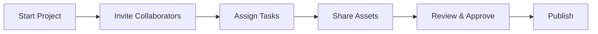

## What a collaboration is in ModelBoard

A collaboration in ModelBoard is a structured project space where models/creators, businesses, and studios coordinate work, assets, and approvals around a shared goal.

Use a collaboration when you need more than a one-off booking or message: for campaigns, lookbooks, recurring content, or any project that involves multiple people, tasks, and deliverables over time.

<Callout kind="info">

Collaborations connect your **Network** (who you work with), **Portfolio** (what you have done), and **Compliance/Verification** (who is verified and what is cleared) into a single workflow.

</Callout>

## Collaboration lifecycle at a glance

Most collaborations follow the same lifecycle:

You do not need every stage for every project, but treating them as checkpoints keeps expectations clear and reduces last‑minute surprises.

## End-to-end collaboration walkthrough

Use this section as a practical checklist for running a standard collaboration from start to finish.

<Steps>

<Step title="Start the project" icon="rocket">

**Goal:** Define what you are doing, for whom, by when, and how success will be measured.

**Do this**

- Clarify the project purpose, scope, and key deliverables.
- Add a short written brief that explains the concept, usage (for example, social, print), and target audience.
- Add a high-level timeline with key dates such as shoot day, review window, and launch.
- Link or reference any relevant Portfolio items to set style expectations.

**Success looks like** everyone involved can read the project space and explain, in one sentence, what the collaboration is about and when it needs to ship.

</Step>

<Step title="Invite collaborators" icon="users">

**Goal:** Bring the right models/creators, businesses, and studios into a shared workspace for this project.

**Do this**

- Decide which collaborators are internal (your team) and which are external (partners or talent).
- Invite collaborators through your existing Network connections or by sharing a targeted project invite.
- Confirm that invited collaborators have up-to-date profiles, including Portfolio samples relevant to the project.
- Make clear who is the primary decision-maker for creative, budget, and approvals.

**Success looks like** every collaborator you expect to participate appears in the project roster and understands why they are included.

</Step>

<Step title="Assign tasks and responsibilities" icon="settings">

**Goal:** Turn the brief into clear, owned tasks so work does not fall through the cracks.

**Do this**

- Break the collaboration into concrete tasks (for example, casting, location scouting, styling, shoot, editing, approvals).
- Assign each task to a specific collaborator or role, not to a generic group.
- Add due dates or time windows for tasks that are blocking others, such as approvals or deliverables.
- Note any dependencies between tasks, like editing starting only after all selects are in.

**Success looks like** each collaborator can see what they are responsible for, when it is due, and what must happen before and after their task.

</Step>

<Step title="Share and organize assets" icon="cloud">

**Goal:** Keep all files, references, and deliverables in one organized place for the collaboration.

**Do this**

- Upload or link reference material (mood boards, past Portfolio work, brand guidelines) into the project.
- Share work-in-progress assets such as casting options, contact sheets, or cuts as they are created.
- Group assets by phase (pre-production, production, post) or by usage (social, print, internal) so they are easy to find.
- Mark sensitive assets that should not be reused outside the agreed context.

**Success looks like** collaborators no longer need to search through messages or email threads to find the latest version of any asset.

</Step>

<Step title="Review and approve work" icon="check-circle">

**Goal:** Capture clear approvals and feedback so everyone knows what is final and what needs changes.

**Do this**

- Set expectations for who must approve different items (for example, talent, client, internal lead).
- Collect feedback on assets in a single place instead of across multiple channels.
- Record explicit approvals for selections, edits, and final deliverables, not just informal comments.
- Track which assets are approved for which channels or territories when that matters.

**Success looks like** each published or delivered asset has a clear approval trail and no one is surprised by what goes live.

</Step>

<Step title="Publish and update your portfolio" icon="upload">

**Goal:** Publish agreed deliverables and keep your Portfolio and Network up to date with the collaboration outcomes.

**Do this**

- Deliver final assets to the agreed destinations (for example, brand channels, internal libraries, public portfolio areas).
- Attribute collaborators correctly so the work appears in the right Network and Portfolio contexts.
- Note any usage limits or expirations that affect how long assets can stay published.
- Capture learnings (what worked, what did not) for future collaborations with the same team.

**Success looks like** the collaboration is marked as complete, published assets match what was approved, and your Portfolio now reflects the new work.

</Step>

</Steps>

## Roles and responsibilities

Different participants see the same collaboration from different angles. Use the guidance below to set expectations and avoid role confusion.

<Tabs>

<Tab title="Model or creator" icon="user">

**Focus:** Present your work clearly, understand expectations, and protect your rights and safety.

- Use your Portfolio to show relevant past work and set realistic expectations about your range.
- Review the project brief, pay, schedule, and usage before you accept; ask for clarification on anything missing.
- Keep your availability, contact details, and compliance or verification status up to date.
- Track which deliverables you are expected to provide (for example, behind-the-scenes content, social posts) and when.
- Confirm how credits, tagging, and Portfolio usage will work once assets are published.

</Tab>

<Tab title="Business" icon="briefcase">

**Focus:** Translate business goals into a clear brief and approvals, while managing risk and brand consistency.

- Define the objective of the collaboration (campaign, launch, always-on content) and how you will measure success.
- Specify required formats, channels, and brand guidelines so collaborators can plan accordingly.
- Assign a single owner for creative sign-off and a single owner for compliance and brand checks.
- Use Network connections and verified profiles to reduce risk when working with new collaborators.
- Decide upfront how you will handle reshoots, additional usage, or changes in scope.

</Tab>

<Tab title="Studio or team" icon="folder">

**Focus:** Coordinate logistics, production, and delivery across multiple collaborators and locations.

- Map the full production timeline from pre-production through delivery, including buffers for review.
- Assign internal team members to own casting, scheduling, production, and post-production tasks.
- Centralize all call sheets, contracts, and key project documents inside the collaboration space.
- Use tasks and asset organization to keep track of which shots, sets, and edits are complete.
- Align with both models/creators and businesses on any changes to schedule, deliverables, or usage.

</Tab>

<Tab title="Enterprise or group account" icon="shield">

**Focus:** Standardize how collaborations run across teams and brands while enforcing compliance and governance.

- Define default collaboration templates with required fields for legal, brand, and security checks.
- Set organization-level rules for who can approve collaborations and publish assets.
- Use verification and compliance data to vet new collaborators before work begins.
- Monitor active collaborations for missing approvals, expired usage rights, or incomplete documentation.
- Establish a clear escalation path for issues such as disputes, takedown requests, or policy violations.

</Tab>

</Tabs>

## Permissions, privacy, and compliance

Treat collaborations as shared workspaces, not public spaces. Only the people you add to a collaboration should see its internal details.

<Callout kind="info">

Use role-based access in your organization to distinguish between those who **participate** in a collaboration (talent, producers, editors) and those who **govern** it (owners, compliance, legal). Limit sensitive information such as rates, contracts, and personal details to the smallest group that needs it.

</Callout>

Respect privacy and local regulations when you share personal information, images, and usage details. Keep sensitive documents (for example, identity verification or contracts) organized, but avoid sharing them more broadly than required for the work.

<Callout kind="alert">

This documentation does not provide legal advice. For questions about consent, releases, IP ownership, or regulatory obligations in your region, involve your legal or compliance team before you publish or repurpose collaboration assets.

</Callout>

Compliance and verification features help you confirm that collaborators are who they say they are, and that you are using assets within agreed terms. Use them to support, not replace, your own review and record-keeping.

## Common issues and how to handle them

<ExpandableGroup>

<Expandable title="Collaborators are unsure what they are expected to deliver" default-open="true">

Clarify the brief and tasks at the project level instead of in private messages.

- Revisit the project description to make sure it states the concept, deliverables, and usage.
- Break work into explicit tasks with clear owners and due dates.
- Link specific assets or Portfolio examples to show the desired outcome.

Once you do this, check that each collaborator has at least one assigned task or a noted responsibility.

</Expandable>

<Expandable title="Deadlines keep slipping or work feels blocked">

Identify where work is waiting for a decision or missing information.

- Look at tasks that are overdue or depend on approvals that have not happened.
- Shorten review loops by defining who has final say and how long they have to respond.
- Group related tasks (for example, all selects for a shoot day) so you can move them through together.

Adjust dates where needed, but always communicate changes in the collaboration space so everyone sees them.

</Expandable>

<Expandable title="Assets are scattered across tools and hard to find later">

Centralize active collaboration assets, even if you use other tools for editing or delivery.

- Upload or link the latest versions into the collaboration instead of relying on messaging apps or email.
- Organize assets into logical groups such as pre-production, production, and final.
- Mark deprecated versions so collaborators know which files are no longer current.

When the project ends, make sure the final, approved assets are clearly labeled and visible in your Portfolio where appropriate.

</Expandable>

<Expandable title="Disagreements about what was approved for publishing">

Reduce ambiguity by capturing approvals in a structured, visible way.

- Request explicit approvals on the assets that will be published, not on drafts or references.
- Record who approved each asset and when, especially for sensitive or long-running campaigns.
- Align on where and how long assets can be used (channels, regions, durations).

If there is a dispute, refer back to the recorded approvals and any linked agreements for guidance.

</Expandable>

<Expandable title="Concerns about privacy, consent, or rights after the project ends">

Handle post-project concerns through your established compliance and governance paths.

- Check recorded approvals and any associated releases or agreements for the asset in question.
- Confirm whether usage windows or conditions have changed since the original agreement.
- Coordinate with your legal or compliance team before making decisions about removal, extension, or new uses.

When in doubt, err on the side of limiting exposure until you are confident the usage is covered.

</Expandable>

</ExpandableGroup>