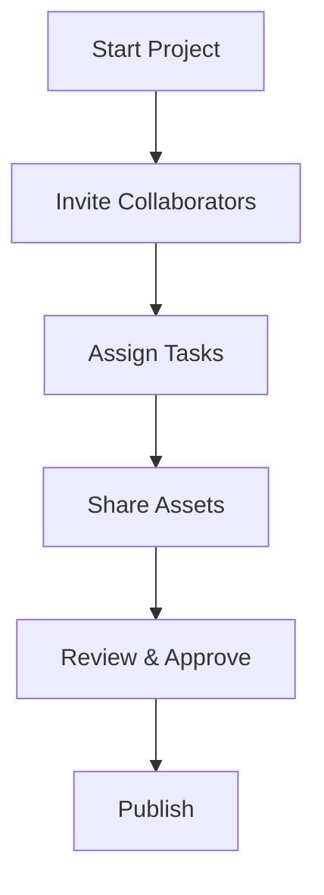

## Overview

ModelBoard provides essential tools designed for the adult entertainment industry. You can build verified profiles, manage collaborative projects, ensure 2257 compliance, and handle casting calls efficiently. These features streamline your workflow whether you are a model, business, studio, or enterprise user.

<Callout kind="info">
Streamline your career and production processes with ModelBoard's industry-specific tools. Start by creating a verified profile to unlock full functionality.
</Callout>

<Columns cols={2}>
  <Card title="Verified Profiles" icon="users" href="#verified-profiles">
    Build professional portfolios with verification badges and industry credits.
  </Card>
  <Card title="Collaboration Tools" icon="git-branch" href="#collaboration">
    Manage projects with shared workflows for creators and teams.
  </Card>
  <Card title="2257 Compliance" icon="shield" href="#compliance">
    Automate record-keeping for seamless legal compliance.
  </Card>
  <Card title="Casting & Talent" icon="search" href="#casting">
    Post calls and search a verified talent database.
  </Card>
</Columns>

## Building Verified Profiles and Portfolios

Create a professional profile to showcase your work, reviews, and credentials. Verification ensures trust in the network.

<Steps>
  <Step title="Sign Up" icon="user-plus">
    Choose your account type: Model, Business, Studio, or Enterprise.
  </Step>
  <Step title="Verify Identity" icon="check-circle">
    Upload required documents for 2257-compliant verification.
  </Step>
  <Step title="Build Portfolio" icon="image">
    Add photos, videos, and links to your content library.
  </Step>
  <Step title="Publish Profile" icon="globe">
    Go live and start networking with industry professionals.
  </Step>
</Steps>

<Tabs>
  <Tab title="Model Account" icon="star">
    Focus on indie creator tools for collaborations and portfolio management.
  </Tab>
  <Tab title="Studio Account" icon="building">
    Manage model applications, casting, and credits for production teams.
  </Tab>
</Tabs>

## Collaboration Workflows for Projects

Coordinate content production with real-time tools. Invite collaborators, assign tasks, and track progress.



<Expandable title="Advanced Workflow Options" default-open="false">

Customize permissions for assets and set deadlines.

```javascript
// Example: Create project via API
const project = await fetch('https://api.example.com/v1/projects', {
  method: 'POST',
  headers: { 'Authorization': 'Bearer YOUR_TOKEN' },
  body: JSON.stringify({
    name: 'New Collab Shoot',
    collaborators: ['user1', 'user2']
  })
});
```

</Expandable>

## Managing 2257 Compliance

Maintain records effortlessly with automated verification flows. ModelBoard handles storage and retrieval for audits.

<Callout kind="alert" title="Legal Note">
Always consult legal experts for 2257 compliance. ModelBoard provides tools but does not offer legal advice.
</Callout>

Use the dashboard to upload and link records to profiles.

<CodeGroup tabs="JavaScript,cURL">
  ```javascript
  // Upload compliance record
  const formData = new FormData();
  formData.append('record', file);
  formData.append('modelId', 'model-123');

  await fetch('https://api.example.com/v1/compliance/2257', {
    method: 'POST',
    headers: { 'Authorization': 'Bearer YOUR_TOKEN' },
    body: formData
  });
  ```
  ```bash
  curl -X POST https://api.example.com/v1/compliance/2257 \
    -H "Authorization: Bearer YOUR_TOKEN" \
    -F "record=@/path/to/record.pdf" \
    -F "modelId=model-123"
  ```
</CodeGroup>

## Casting Calls and Talent Database

Post casting calls and search verified talent. Filter by skills, location, and availability.

| Feature | Description |
|---------|-------------|
| Talent Search | Advanced filters for models and pros |
| Casting Posts | Public or private calls with applications |
| Credits Database | Track industry experience |

<Expandable title="Integration Example">
Connect your CRM via webhooks.

````javascript
// Webhook handler example
app.post('/webhook/casting', (req, res) => {
  const { applicantId, callId } = req.body;
  // Process application
});
````

</Expandable>