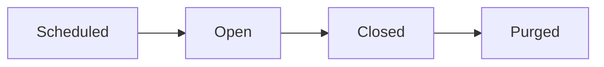

## Overview

MB Events helps Business account holders create, manage, and promote industry events on ModelBoard. Attendees can register for events, view event details, participate in event-specific chat, and connect with other people who are attending.

For attendees, MB Events is the place to follow event updates and join event conversations without moving to a separate app. For organizers, it combines event management with built-in communication tools, including announcement channels, attendee discussion, moderation, and reporting.

The attendee chat is designed for real-time communication before, during, and after an event. You can use it to ask questions, coordinate logistics, share updates, and continue conversations with other confirmed attendees.

## Event attendee chat

Attendee chat gives confirmed registrants and organizers a shared space to communicate around an event.

<Callout kind="info">

Attendee chat is available to confirmed event registrants and event organizers. If your registration is pending, canceled, or not confirmed, you will not be able to join the chat.

</Callout>

### Accessing the chat

Open the event page to access chat. If your registration is confirmed, the chat appears as part of the event experience and opens directly from that event.

On desktop, chat uses a two-pane layout:

- The **left pane** shows your channels
- The **right pane** shows the message thread for the selected channel

On mobile, the same interface appears one pane at a time so you can switch between the channel list and the current conversation more easily on a smaller screen.

If you are not eligible to join, or if chat is not currently available for that event, the event page shows an access message instead of the conversation interface.

### Channel types

Different channel types support different kinds of event communication.

<Tabs>

  <Tab title="Standard" icon="hash">

  Standard channels are two-way conversations. Everyone with access to the event chat can read messages and send their own messages in the channel.

  Standard channels work best for:

  - Attendee introductions
  - Logistics questions
  - Meetups and coordination
  - General event discussion

  </Tab>
  <Tab title="Announcement" icon="megaphone">

  Announcement channels are read-only for attendees. Only the organizer can post new messages, and attendees can follow updates without the channel filling with replies.

  Announcement channels work best for:

  - Schedule changes
  - Venue updates
  - Check-in instructions
  - Important event notices

  Attendees receive notifications when a new announcement is posted.

  </Tab>
</Tabs>

<Callout kind="tip">

Organizers can create channels and choose whether each one is a standard channel or an announcement channel.

</Callout>

### Chat lifecycle

Event chat changes state over time, so what you can do depends on where the event is in its lifecycle.

#### Scheduled

During the scheduled state, the chat exists but is not open to attendees yet. If you are an attendee, you will see the message **Chat isn't open yet.**

Organizers can still post during this state, which is useful for preparing announcement channels before attendees gain access.

#### Open

During the open state, eligible attendees and organizers can read messages and send messages normally. This is the full active chat experience for the event.

If you can type in the message composer and messages appear in the channel, the chat is open.

#### Closed

During the closed state, no one can send new messages in the event chat. Everyone sees the message **Chat is closed for this event.**

You may still be able to view older messages until the purge window is reached.

#### Purged

During the purged state, all event chat messages are permanently deleted. After purging, previous conversation history is no longer available in the event chat.

Chat closes automatically 30 days after the event ends. Messages are purged 60 days after the event ends.

If there are active legal-flagged reports, purging is skipped until those reports are no longer active.

<Callout kind="info">

Organizers can choose a pre-event open time so chat becomes available before the event starts. This gives attendees time to coordinate travel, introductions, or last-minute questions.

</Callout>

### Sending and managing messages

Use the chat tools to participate in channels, mention other attendees, and manage your own messages.

<Steps>

  <Step title="Send a message" icon="edit">

  Type your message in the composer and press <kbd>Enter</kbd> to send it. Press <kbd>Shift</kbd> + <kbd>Enter</kbd> to start a new line without sending.

  Messages have a 4,000 character limit, and the composer shows a live character counter as you type.

  Success looks like:

  - Your message appears in the thread immediately
  - Other recent messages stay visible in the conversation
  - If sending fails, you see a retry option on the failed message

  </Step>
  <Step title="Mention someone" icon="users">

  Type `@` in the composer to open the member list for the current channel. Select a person from the autocomplete results to insert their `@handle` into your message.

  Mentioned users receive a notification, which helps when you need someone's attention in a busy channel.

  Success looks like:

  - The selected `@handle` appears in your draft
  - The mention stays linked after you send the message

  </Step>
  <Step title="Edit a message" icon="edit">

  Open the dropdown menu on one of your own messages and select **Edit**. You can edit your message within 15 minutes of posting.

  Edited messages show an **(edited)** label so the conversation history remains clear to everyone in the channel.

  Success looks like:

  - The updated text replaces the original message
  - The message displays the **(edited)** label

  </Step>
  <Step title="Delete a message" icon="trash">

  Open the dropdown menu on your message and select **Delete**. You can delete your own messages at any time.

  Organizers can delete any message in event channels. Deleted messages show as **Message deleted** and are removed from normal view, but retained for records.

  Success looks like:

  - The original message content no longer appears
  - The conversation shows **Message deleted** in its place

  </Step>
</Steps>

### Direct messages and blocking

Each message includes a direct message bubble next to the sender. Use it to interact with that attendee outside the public event channel.

From that menu, you can:

- Start a direct message with another attendee
- Block a user
- Unblock a user

When you block someone, their messages are hidden from your view and you stop receiving notifications from them. If you later unblock them, their messages become visible to you again.

<Callout kind="alert">

Blocking is mutual in effect. If you block someone, their messages are hidden from you and your messages are hidden from them.

</Callout>

### Notifications

Chat notifications help you keep up with activity that needs your attention.

<Tabs>

  <Tab title="Mentions" icon="at-sign">

  You receive a notification when someone mentions you with your `@handle` in any event channel you can access.

  </Tab>
  <Tab title="Announcements" icon="megaphone">

  You receive a notification when a new message is posted in an announcement channel.

  </Tab>
  <Tab title="Direct Messages" icon="message-circle">

  You receive a notification when another attendee sends you a direct message.

  </Tab>
</Tabs>

<Callout kind="tip">

You can mute specific channels to stop notifications from that channel while continuing to receive notifications from others. Notifications are enabled by default.

</Callout>

### Presence indicators

Presence indicators help you understand who is active in the conversation right now.

- **Online indicator** — A green dot on a user's avatar shows that they are currently active in the channel.
- **Typing indicator** — When someone is writing a message, you see **Someone is typing…** below the message list.

### Unread messages

Unread indicators help you return to the right place when activity happens while you are away.

- The channel list shows an unread badge that updates every 30 seconds
- Large unread counts display as **99+**
- When you open a channel with unread activity, a red **New** divider marks where new messages begin
- Messages are automatically marked as read while you are viewing that channel

### Reporting content

Use reporting tools when a message or user needs moderator review.

<Steps>

  <Step title="Report a message or user" icon="alert-triangle">

  Open the dropdown menu on a message, or use the menu in the direct message bubble, then choose the report option.

  Success looks like:

  - A report form opens for the selected message or user
  - The report stays tied to the original content

  </Step>
  <Step title="Choose a reason" icon="help-circle">

  Select the reason that best matches the issue. Some report reasons are treated as legal-floor categories, including CSAM, non-consensual intimate imagery, threats of violence, and trafficking indicators.

  These reports receive stricter handling than standard moderation reports.

  </Step>
  <Step title="Add context" icon="edit">

  Add any details that will help reviewers understand what happened. You can include up to 1,000 characters of additional context.

  Context is optional, but it can speed up review when the issue depends on surrounding behavior or timing.

  </Step>
  <Step title="Understand what happens next" icon="check-circle">

  Standard reports go to the event organizer for review. Legal-floor reports are escalated to Platform Admin automatically.

  Organizers can review standard reports, but they cannot dismiss legal-flagged reports.

  Success looks like:

  - Your report is submitted successfully
  - The reported content enters the appropriate review queue

  </Step>
</Steps>

<Callout kind="alert">

Legal-floor reports are escalated automatically and locked from organizer dismissal.

</Callout>

## Organizer controls

Organizers have additional controls to shape the event chat experience, communicate with attendees, and handle moderation issues as they arise.

### Channel management

Organizers can create, edit, and configure event channels. Each channel can be set up as either a standard channel for two-way conversation or an announcement channel for organizer-only posting.

Organizers can post in any channel, including announcement channels. This makes it easier to keep urgent updates separate from attendee discussion.

### Chat settings

Organizers can control when chat becomes available by setting a pre-event open time. That setting is useful when attendees need time to coordinate before the event begins.

Organizers can also configure the closure notice schedule so attendees are warned before chat access ends. The default reminder schedule is 7 days and 1 day before closure, and organizers can customize that timeline anywhere from 0 to 90 days.

### Reports queue

Organizers see chat reports in an admin queue with open and closed views. This makes it easier to separate issues that still need action from reports that are already resolved.

For each open standard report, organizers can:

- Remove the reported message
- Remove the user from all event channels
- Dismiss the report

Legal-flagged reports cannot be dismissed by organizers. Those reports are escalated to Platform Admin for handling.

### Managing messages

Organizers can delete any message posted in the event's channels. This applies across attendee discussion and organizer-run channels.

If an organizer removes a user from channels, that person loses access to see or post in any chat channel for that event.

## Common questions

<ExpandableGroup>

  <Expandable title="Why can't I send messages in the chat?" default-open="false">

  You may be in a channel that does not allow attendee replies, such as an announcement channel. You may also be trying to use chat before it opens or after it closes.

  If the chat is still scheduled, you will see **Chat isn't open yet.** If the event chat has closed, you will see **Chat is closed for this event.** If you are not a confirmed registrant, you may not have access at all.

  </Expandable>
  <Expandable title="Why can't I see someone's messages?" default-open="false">

  The most common reason is blocking. If you block another attendee, their messages are hidden from you, and your messages are hidden from them.

  If you previously blocked someone, unblocking them restores their messages to your view.

  </Expandable>
  <Expandable title="How long does the chat stay open?" default-open="false">

  Event chat closes automatically 30 days after the event ends. Messages are then purged 60 days after the event ends.

  If active legal-flagged reports still exist, message purging is delayed until those reports no longer require retention.

  </Expandable>
  <Expandable title="What happens to my reports?" default-open="false">

  Standard reports go to the event organizer for review. The organizer can remove content, remove the reported user from event channels, or dismiss the report.

  Legal-floor reports follow a stricter path. They are escalated to Platform Admin automatically and cannot be dismissed by the organizer.

  </Expandable>
</ExpandableGroup>

## What to do next

Use MB Events to keep event coordination in one place: event details, attendee communication, announcements, and moderation all stay tied to the same event.

<Columns cols={2}>

  <Card
    title="Features Overview"
    href="/features"
    icon="file-text"
    cta="Explore all features"
    horizontal="false"
  >

    See how MB Events fits into the broader ModelBoard feature set.

  </Card>

  <Card
    title="Help Center"
    href="/help-center"
    icon="help-circle"
    cta="Get support"
    horizontal="false"
  >

    Find answers to common questions and troubleshooting guidance.

  </Card>

</Columns>